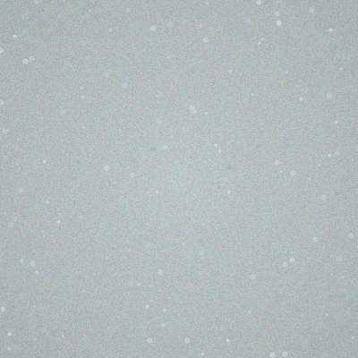
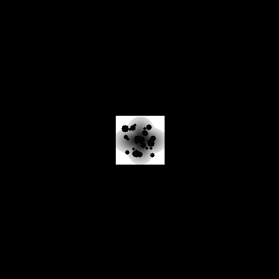
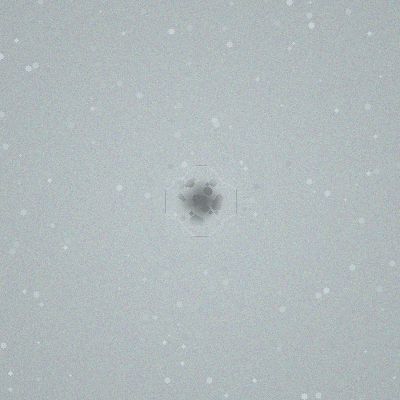
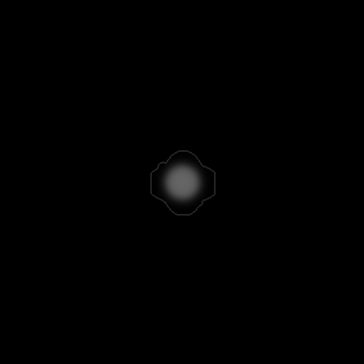
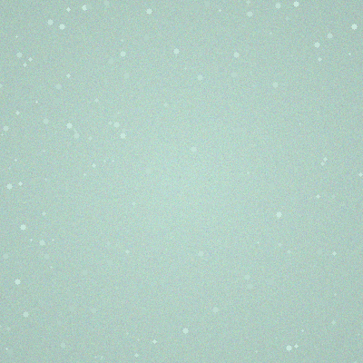
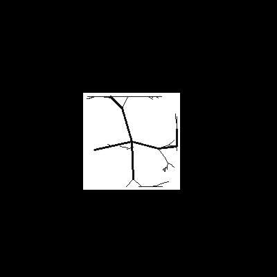
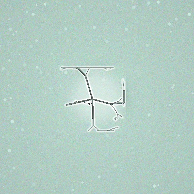
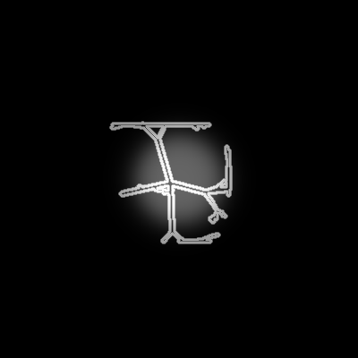

<div align="center">

[English](#-english) | [中文](#-中文)

</div>

---

# 🇨🇳 &nbsp; 中文

---

# Adaptive Edge Blending / 自适应边缘融合算法

<div align="center">

[](https://www.python.org/)
[](LICENSE)

**让缺陷自然融入背景的图像融合算法**

</div>

## 目录
- [算法介绍](#算法介绍)
- [效果展示](#效果展示)
- [快速开始](#快速开始)
- [算法原理](#算法原理)
- [项目结构](#项目结构)

---

## 算法介绍

**Adaptive Edge Blending** 是一个轻量级、高性能的图像融合算法，主要解决以下问题：

| 问题 | 解决方式 |
|------|---------|
| 边缘不连续 | 使用有符号距离场构建平滑过渡区 |
| 颜色不协调 | 融合前分析局部纹理，自适应权重 |
| 计算复杂 | 无需GPU，纯Python实现，即插即用 |

### 应用场景

- 🏭 **工业质检数据增强** - 为缺陷检测模型生成训练样本
- 📸 **图像修复/旧照翻新** - 填补照片划痕、破损区域
- 🎮 **VR/AR** - 无缝叠加虚拟物体
- 🖼️ **图片编辑/广告设计** - 合成素材
- 🏛️ **文物数字化修复** - 修复照片缺损

---

## 效果展示

### 深色污点融合示例

| 原始背景 | 放置缺陷 | 融合结果 | 权重图 |
|---------|---------|---------|--------|
|  |  |  |  |

### 裂纹缺陷融合示例

| 原始背景 | 放置缺陷 | 融合结果 | 权重图 |
|---------|---------|---------|--------|
|  |  |  |  |

---

## 快速开始

### 1. 安装依赖

```bash
python install_deps.py
```

或手动安装：

```bash
pip install numpy opencv-python scipy
```

### 2. 生成示例数据

```bash
python generate_sample_data.py
```

### 3. 运行程序

```bash
python main.py
```

---

## 算法原理

### 核心流程

```
输入: 背景 + 缺陷 + 掩码
    ↓
步骤1: 计算有符号距离场(SDF)
    ↓
步骤2: 计算基础权重图 - 基于距离
    ↓
步骤3: 计算局部统计信息 - 纹理分析
    ↓
步骤4: 计算纹理权重 - 相似度越高权重越高
    ↓
步骤5: 双权重融合
    ↓
输出: 自然融合的图像
```

### 关键技术亮点

- **SDF驱动过渡区** - 过渡边界贴合缺陷形状
- **纹理感知权重** - 纹理相似区域用更多缺陷像素
- **tanh平滑函数** - S型曲线，过渡自然
- **双权重混合** - 兼顾平滑和真实感

---

## 项目结构

```
OptimizeAlgorithm/
├── edge_blending.py       # 核心算法模块
├── evaluation.py          # 质量评估模块
├── batch_processor.py     # 批量处理模块
├── main.py              # 主程序入口
├── generate_sample_data.py  # 示例数据生成器
├── requirements.txt     # 依赖清单
├── install_deps.py       # 依赖安装脚本
├── demo/                # 示例图片
└── datasets/            # 数据集目录
```

---

## 添加自己的数据集

### 目录结构

```
datasets/
├── backgrounds/   # 放入背景图
├── defects/     # 放入缺陷图
└── masks/       # 放入掩码图
```

### 文件对应规则

三个目录中的文件按文件名排序后一一对应。

---

---

# 🔤 &nbsp; English

---

# Adaptive Edge Blending

<div align="center">

[](https://www.python.org/)
[](LICENSE)

**Seamlessly blend defects into background images**

</div>

## Table of Contents
- [Introduction](#introduction)
- [Demo Results](#demo-results)
- [Quick Start](#quick-start)
- [Algorithm Overview](#algorithm-overview)
- [Project Structure](#project-structure)

---

## Introduction

**Adaptive Edge Blending** is a lightweight, high-performance image blending algorithm that solves:

| Problem | Solution |
|---------|----------|
| Edge discontinuity | Smooth transition with Signed Distance Field |
| Color inconsistency | Texture-aware adaptive weights |
| Complex computation | No GPU required, pure Python, plug-and-play |

### Application Scenarios

- 🏭 **Industrial Quality Inspection Data Augmentation** - Generate training samples for defect detection
- 📸 **Image Restoration / Photo Restoration** - Fill in scratches and damaged areas
- 🎮 **VR/AR** - Seamless virtual object overlay
- 🖼️ **Image Editing / Ad Design** - Composite materials
- 🏛️ **Cultural Heritage Digitization** - Restore photo restoration

---

## Demo Results

### Dark Stain Blending Example

| Original Background | Defect Placed | Blended Result | Weight Map |
|--------------------|---------------|----------------|-----------|
|  |  |  |  |

### Crack Defect Blending Example

| Original Background | Defect Placed | Blended Result | Weight Map |
|--------------------|---------------|----------------|-----------|
|  |  |  |  |

---

## Quick Start

### 1. Install Dependencies

```bash
python install_deps.py
```

Or install manually:

```bash
pip install numpy opencv-python scipy
```

### 2. Generate Sample Data

```bash
python generate_sample_data.py
```

### 3. Run the Program

```bash
python main.py
```

---

## Algorithm Overview

### Core Pipeline

```
Input: Background + Defect + Mask
    ↓
Step 1: Compute Signed Distance Field (SDF)
    ↓
Step 2: Compute Base Weight Map - distance-based
    ↓
Step 3: Compute Local Statistics - texture analysis
    ↓
Step 4: Compute Texture Weight - higher similarity = higher weight
    ↓
Step 5: Dual-weight blending
    ↓
Output: Naturally blended image
```

### Key Technical Highlights

- **SDF-driven transition zone** - transition boundary fits defect shape
- **Texture-aware weights** - more defect pixels in similar texture regions
- **tanh smoothing** - S-curve for natural transition
- **Dual-weight blend** - balance between smoothness and realism

---

## Project Structure

```
OptimizeAlgorithm/
├── edge_blending.py       # Core algorithm module
├── evaluation.py          # Quality assessment module
├── batch_processor.py     # Batch processing module
├── main.py              # Main program entry
├── generate_sample_data.py  # Sample data generator
├── requirements.txt     # Dependency list
├── install_deps.py       # Dependency installation script
├── demo/                # Demo images
└── datasets/            # Dataset directory
```

---

## Add Your Own Dataset

### Directory Structure

```
datasets/
├── backgrounds/   # Place background images
├── defects/     # Place defect images
└── masks/       # Place mask images
```

### File Matching Rule

Files in the three directories are matched one-to-one after sorting by filename.

---

<div align="center">

[Back to Top](#-中文) | [English](#-english)

</div>
